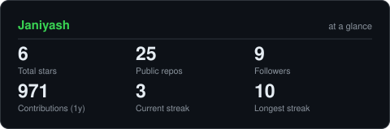
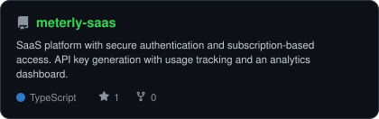
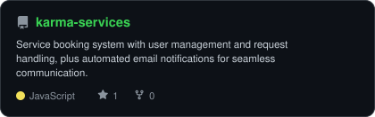
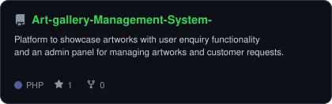

<div align="center">

<!-- PORTRAIT - generated by scripts/dotify.py from your photo.
     Colour mode, so one file serves both GitHub themes. Regenerate with:
       python scripts/dotify.py photo.png -o assets/portrait \
         --cols 100 --equalize --detail 0.5 --color --reveal -->


<p align="center">
  
</p>


</div>

```bash
> Name:          Yash Jani
> Role:          Full-Stack Web Developer
> Status:        Learning • Building • Improving
> Website:       https://yashjani.vercel.app/
> Email:         janiyash0911@gmail.com
> Current Focus: Backend Development & APIs
> Base:          India
```

---

## 🚀 What I Do
- Build full-stack web applications using **MERN Stack** and **PHP**
- Design and develop **RESTful APIs**
- Implement **authentication & authorization**
- Work with **MySQL databases** using efficient **CRUD operations**
- Focus on clean code, scalability, and real-world problem solving

---

## 💼 Open To
- Remote Internship Opportunities  
- Full-Stack Developer Intern Roles  
- Backend / Web Development Roles  

---

## 🌐 Connect With Me
<p align="center">
  <a href="https://linkedin.com/in/jani-yash"></a>
  <a href="https://yashjani.vercel.app/"></a>
  <a href="https://github.com/Janiyash"></a>
</p>

---

## 🧩 Featured Projects
🔹 **Meterly SaaS Platform**  
- Built a SaaS platform with secure authentication and subscription-based access 
- Implemented API key generation with usage tracking and analytics dashboard  

🔹 **KARM Services Platform**  
- Developed a service booking system with user management and request handling
- Integrated automated email notifications for seamless communication

🔹 **Art Gallery Management System**  
- Created a platform to showcase artworks with user enquiry functionality
- Developed an admin panel for managing artworks and customer requests

---

## 🧰 Tech Stack & Tools
```bash
> Languages:  Python, Java, C, JavaScript
> Frontend:   HTML5, CSS3, JavaScript, Tailwind CSS, Responsive Design
> Backend:    PHP, Node.js, REST APIs, Authentication & Authorization
> Database:   MySQL, SQL Statements, CRUD Operations
> Tools:      Git, GitHub, VS Code, XAMPP, Postman, MVC Architecture
```

---

## 🔧 Technologies
<div align="left">
  
  
  
  
  
  
  
  
  
  
  
  
  
  
  
  
  
  
  
  
  
  
  
  
  
</div>

---

<div align="center">

## 🧭 Skill Radar

<table>
<tr>
<td width="50%" align="center" valign="middle">

<!-- Self-rated — edit assets/skills.json, the "Charts and cards" workflow redraws this -->
<picture>
  <source media="(prefers-color-scheme: dark)"  srcset="assets/radar-dark.svg">
  <source media="(prefers-color-scheme: light)" srcset="assets/radar-light.svg">
  
</picture>

</td>
<td width="50%" align="center" valign="middle">

<!-- Live — built from real language byte counts across all your repos -->
<picture>
  <source media="(prefers-color-scheme: dark)"  srcset="assets/radar-langs-dark.svg">
  <source media="(prefers-color-scheme: light)" srcset="assets/radar-langs-light.svg">
  
</picture>

</td>
</tr>
</table>

</div>

---

## 📊 GitHub Activity


---
## 📊 GitHub Stats


<!-- Fallback mirror if the line above ever breaks again — swap it in the same way:
 -->

---

<div align="center">

## 🏙️ Contribution Calendar

<!-- 3D isometric calendar — regenerated every 6h by .github/workflows/metrics.yml -->


<br><br>

<!-- Snake eats the contribution graph — .github/workflows/snake.yml, pushed to the `output` branch -->
<picture>
  <source media="(prefers-color-scheme: dark)"  srcset="https://raw.githubusercontent.com/Janiyash/Janiyash/output/snake-dark.svg">
  <source media="(prefers-color-scheme: light)" srcset="https://raw.githubusercontent.com/Janiyash/Janiyash/output/snake.svg">
  
</picture>

</div>

---

<div align="center">

## 📦 The Numbers

<!-- Generated by scripts/cards.py into this repo — self-hosted so it doesn't
     depend on shared public instances (streak-stats/activity-graph above) going down -->
<picture>
  <source media="(prefers-color-scheme: dark)"  srcset="assets/card-stats-dark.svg">
  <source media="(prefers-color-scheme: light)" srcset="assets/card-stats-light.svg">
  
</picture>

<br>


<br><br>


</div>

---

<div align="center">

## 🗂️ Selected Work

<!-- Cards generated by scripts/cards.py from assets/projects.json — stars,
     forks and language pulled live from the API on every run -->
<table>
<tr>
<td width="50%">
  <a href="https://github.com/Janiyash/meterly-saas">
    <picture>
      <source media="(prefers-color-scheme: dark)"  srcset="assets/card-meterly-saas-dark.svg">
      <source media="(prefers-color-scheme: light)" srcset="assets/card-meterly-saas-light.svg">
      
    </picture>
  </a>
</td>
<td width="50%">
  <a href="https://github.com/Janiyash/karma-services">
    <picture>
      <source media="(prefers-color-scheme: dark)"  srcset="assets/card-karma-services-dark.svg">
      <source media="(prefers-color-scheme: light)" srcset="assets/card-karma-services-light.svg">
      
    </picture>
  </a>
</td>
</tr>
<tr>
<td colspan="2" align="center">
  <a href="https://github.com/Janiyash/Art-gallery-Management-System-">
    <picture>
      <source media="(prefers-color-scheme: dark)"  srcset="assets/card-Art-gallery-Management-System--dark.svg">
      <source media="(prefers-color-scheme: light)" srcset="assets/card-Art-gallery-Management-System--light.svg">
      
    </picture>
  </a>
</td>
</tr>
</table>

</div>

---
⭐ *Consistency beats intensity. Keep building.*