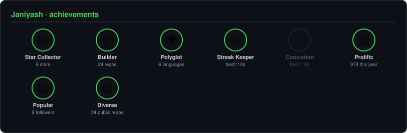

<div align="center">

<!-- PORTRAIT - generated by scripts/dotify.py from your photo.
     Colour mode, so one file serves both GitHub themes. Regenerate with:
       python scripts/dotify.py photo.png -o assets/portrait \
         --cols 100 --equalize --detail 0.5 --color --reveal -->


<p align="center">
  
</p>

**🟢 Open to remote internships and full-stack / backend roles**

<p>
  <a href="#-what-i-do">About</a> •
  <a href="#-technologies">Skills</a> •
  <a href="#-selected-work">Projects</a> •
  <a href="#-recent-activity">Activity</a> •
  <a href="#-the-numbers">Stats</a> •
  <a href="#-connect-with-me">Contact</a>
</p>

</div>

```bash
> Name:          Yash Jani
> Role:          Full-Stack Web Developer
> Status:        Learning • Building • Improving
> Website:       https://yashjani.vercel.app/
> Email:         janiyash0911@gmail.com
> Current Focus: Backend Development & APIs
> Base:          India
```

---

## 🚀 What I Do
- Build full-stack web applications using **MERN Stack** and **PHP**
- Design and develop **RESTful APIs**
- Implement **authentication & authorization**
- Work with **MySQL databases** using efficient **CRUD operations**
- Focus on clean code, scalability, and real-world problem solving

---

## 🔧 Technologies
<div align="center">


</div>

<details>
<summary><b>Full breakdown by category</b></summary>
<br>

```bash
> Languages:  Python, Java, C, JavaScript
> Frontend:   HTML5, CSS3, JavaScript, Tailwind CSS, Responsive Design
> Backend:    PHP, Node.js, REST APIs, Authentication & Authorization
> Database:   MySQL, SQL Statements, CRUD Operations
> Tools:      Git, GitHub, VS Code, XAMPP, Postman, MVC Architecture
```

</details>

---

<div align="center">

## 🗂️ Selected Work

<!-- Cards generated by scripts/cards.py from assets/projects.json — stars,
     forks and language pulled live from the API every 6h -->
<table>
<tr>
<td width="50%">
  <a href="https://github.com/Janiyash/meterly-saas">
    <picture>
      <source media="(prefers-color-scheme: dark)"  srcset="assets/card-meterly-saas-dark.svg">
      <source media="(prefers-color-scheme: light)" srcset="assets/card-meterly-saas-light.svg">
      
    </picture>
  </a>
</td>
<td width="50%">
  <a href="https://github.com/Janiyash/karma-services">
    <picture>
      <source media="(prefers-color-scheme: dark)"  srcset="assets/card-karma-services-dark.svg">
      <source media="(prefers-color-scheme: light)" srcset="assets/card-karma-services-light.svg">
      
    </picture>
  </a>
</td>
</tr>
<tr>
<td colspan="2" align="center">
  <a href="https://github.com/Janiyash/Art-gallery-Management-System-">
    <picture>
      <source media="(prefers-color-scheme: dark)"  srcset="assets/card-Art-gallery-Management-System--dark.svg">
      <source media="(prefers-color-scheme: light)" srcset="assets/card-Art-gallery-Management-System--light.svg">
      
    </picture>
  </a>
</td>
</tr>
</table>

<sub>Click any card to open the repo — stars, forks, and primary language update automatically.</sub>

</div>

---

## 📌 Recent Activity
<!--START_SECTION:activity-->
<!--END_SECTION:activity-->
<sub>Auto-updated every 6h from real GitHub events by <code>.github/workflows/activity.yml</code>.</sub>

---

## 📊 GitHub Activity


---

<div align="center">

## 🏙️ Contribution Calendar

<!-- 3D isometric calendar — regenerated every 6h by .github/workflows/metrics.yml -->


</div>

---

<div align="center">

## 📦 The Numbers

<!-- Generated by scripts/cards.py into this repo — self-hosted so it doesn't
     depend on shared public instances (streak-stats/activity-graph) going down.
     Total contributions and both streaks live here, so a separate streak badge
     would just repeat these same numbers. -->
<picture>
  <source media="(prefers-color-scheme: dark)"  srcset="assets/card-stats-dark.svg">
  <source media="(prefers-color-scheme: light)" srcset="assets/card-stats-light.svg">
  
</picture>

<br><br>

<!-- Self-hosted achievements badge, generated by scripts/achievements.py -->
<picture>
  <source media="(prefers-color-scheme: dark)"  srcset="assets/achievements-dark.svg">
  <source media="(prefers-color-scheme: light)" srcset="assets/achievements-light.svg">
  
</picture>

</div>

---

## 🌐 Connect With Me
<p align="center">
  <a href="https://linkedin.com/in/jani-yash"></a>
  <a href="https://yashjani.vercel.app/"></a>
  <a href="https://github.com/Janiyash"></a>
  <a href="mailto:janiyash0911@gmail.com"></a>
  <!-- Add a real resume link once you have one hosted, e.g. a PDF in this repo or on your portfolio:
  <a href="https://yashjani.vercel.app/resume.pdf"></a> -->
</p>

---
⭐ *Consistency beats intensity. Keep building.*